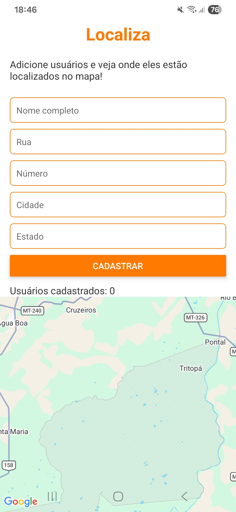
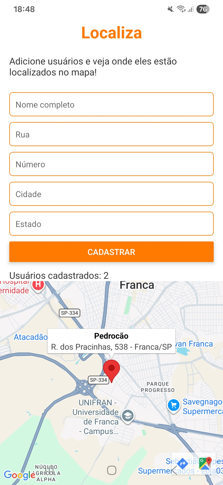
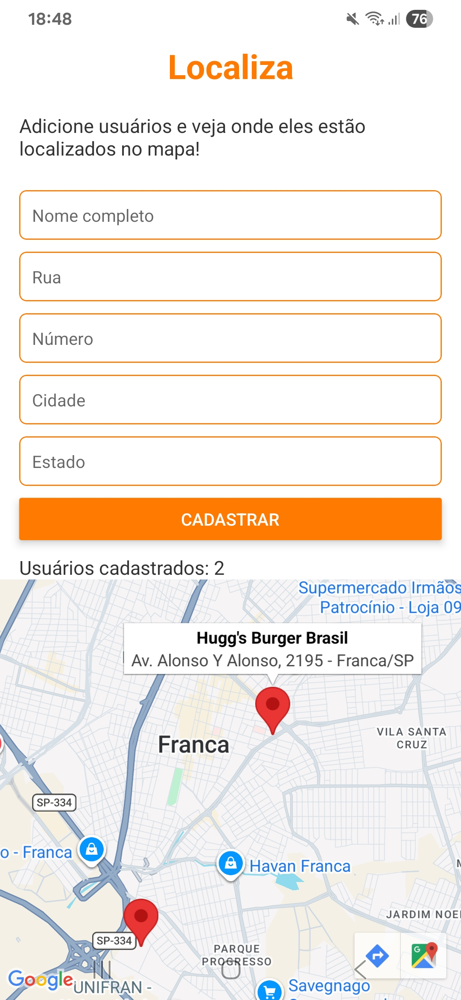

# Localiza

Aplicativo mobile feito com React Native e Expo para cadastrar usuários por endereço e exibir os pontos no mapa.

## Objetivo

Permitir o cadastro de pessoas com nome e endereço, transformar esse endereço em coordenadas geográficas e mostrar cada usuário com marcador no mapa.

## Funcionalidades

- Cadastro de usuário com nome, rua, número, cidade e estado
- Validação de campos obrigatórios
- Conversão de endereço para latitude/longitude com geocodificação
- Exibição de marcadores no mapa para cada usuário cadastrado
- Contador de usuários cadastrados em tempo real

## Tecnologias

- React Native
- Expo
- expo-location
- react-native-maps

## Como executar

### Pré-requisitos

- Node.js instalado
- Expo Go no celular (opcional)
- Android Studio / emulador Android (opcional)

### Passos

1. Instale as dependências:

```bash
npm install
```

2. Inicie o projeto:

```bash
npm start
```

3. Execute no ambiente desejado:

```bash
npm run android
# ou
npm run ios
# ou
npm run web
```

## Permissões

O aplicativo solicita permissão de localização em primeiro plano para acessar serviços de geocodificação.

## Estrutura principal

```text
src/
  hooks/
    useLocation.js
  pages/
    Main.js
```

## Prints mobile para demonstração

<table>
  <tr>
    <td align="center"><strong>Home</strong></td>
    <td align="center"><strong>Adiciona "usuário"</strong></td>
    <td align="center"><strong>Adiciona segundo "usuário"</strong></td>
  </tr>
  <tr>
    <td align="center"></td>
    <td align="center"></td>
    <td align="center"></td>
  </tr>
</table>
